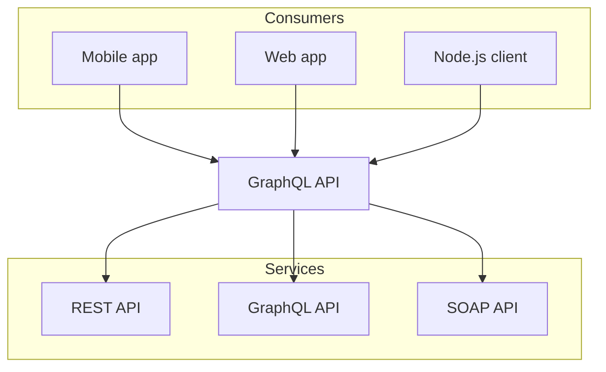

# Guide

[official guide](https://nextra.site/docs/guide/markdown)

# Syntax Highlight

~~~markdown
```ts
const a = 42;
```
~~~

```ts
const a = 42;
```

## Highlight line

~~~markdown
```js {1,4-5}
import { useState } from 'react'

function Counter() {
  const [count, setCount] = useState(0)
  return <button onClick={() => setCount(count + 1)}>{count}</button>
}
```
~~~

```js {1,4-5}
import { useState } from 'react'

function Counter() {
  const [count, setCount] = useState(0)
  return <button onClick={() => setCount(count + 1)}>{count}</button>
}
```

## Copy

~~~markdown
```ts copy
const a = 42;
```
~~~

```ts copy
const a = 42;
```

## Line Numbers

~~~markdown
```js showLineNumbers
import { useState } from 'react'

function Counter() {
  const [count, setCount] = useState(0)
  return <button onClick={() => setCount(count + 1)}>{count}</button>
}
```
~~~

```js showLineNumbers
import { useState } from 'react'

function Counter() {
  const [count, setCount] = useState(0)
  return <button onClick={() => setCount(count + 1)}>{count}</button>
}
```

## Filenames and Titles

~~~markdown
```js filename="example.js"
console.log('hello, world')
```
~~~

```js filename="example.js"
console.log('hello, world')
```

## showLineNumbers and copy, filename

~~~markdown
```js filename="example.js" showLineNumbers copy
console.log('hello, world')
```
~~~

```js filename="example.js" showLineNumbers copy
console.log('hello, world')
```

# Table

```
| Syntax        | Description |   Test Text |
| :------------ | :---------: | ----------: |
| Header        |    Title    | Here's this |
| Paragraph     |    Text     |    And more |
| Strikethrough |             |    ~~Text~~ |
```

| Syntax        | Description |   Test Text |
| :------------ | :---------: | ----------: |
| Header        |    Title    | Here's this |
| Paragraph     |    Text     |    And more |
| Strikethrough |             |    ~~Text~~ |

# Task List

```
- [x] Write the press release
- [ ] Update the website
- [ ] Contact the media
```

- [x] Write the press release
- [ ] Update the website
- [ ] Contact the media

# Image

```

```


# Mermaid

~~~markdown

~~~


